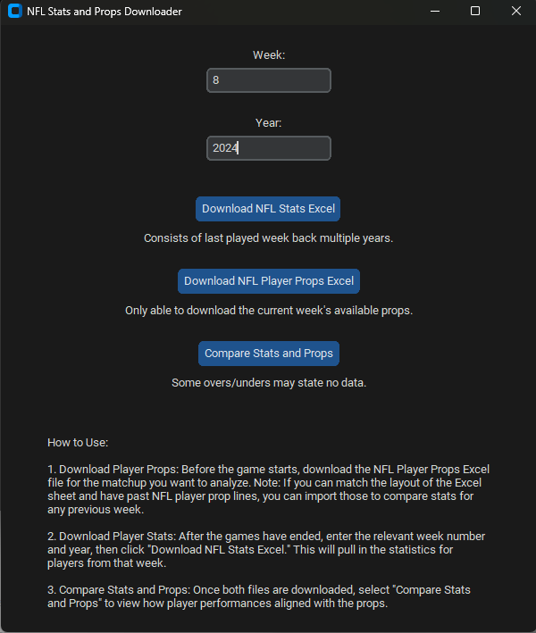
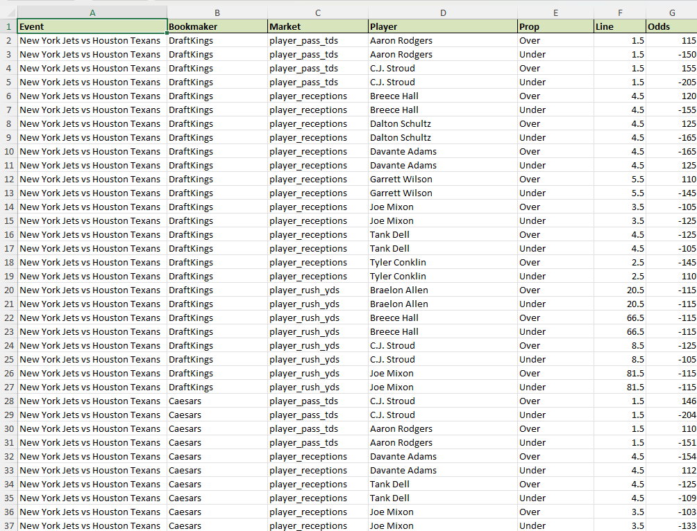
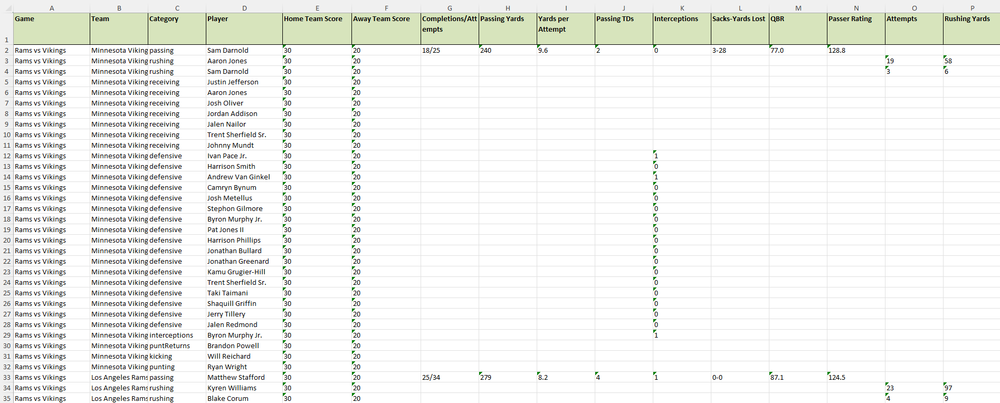
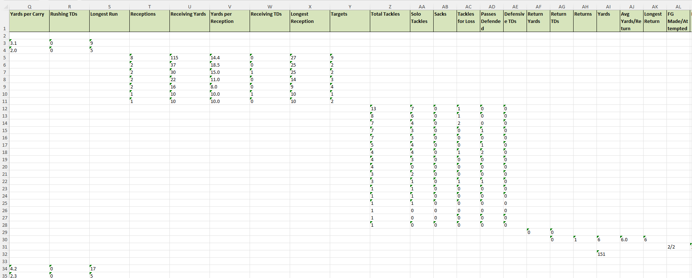
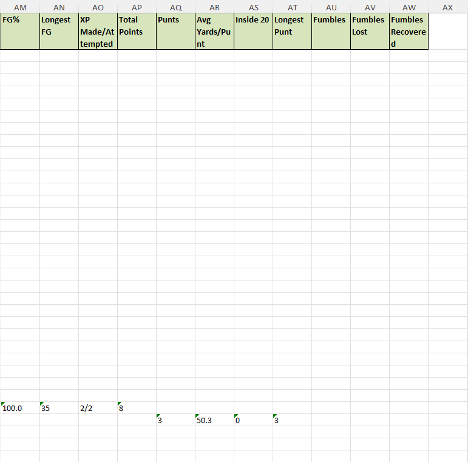
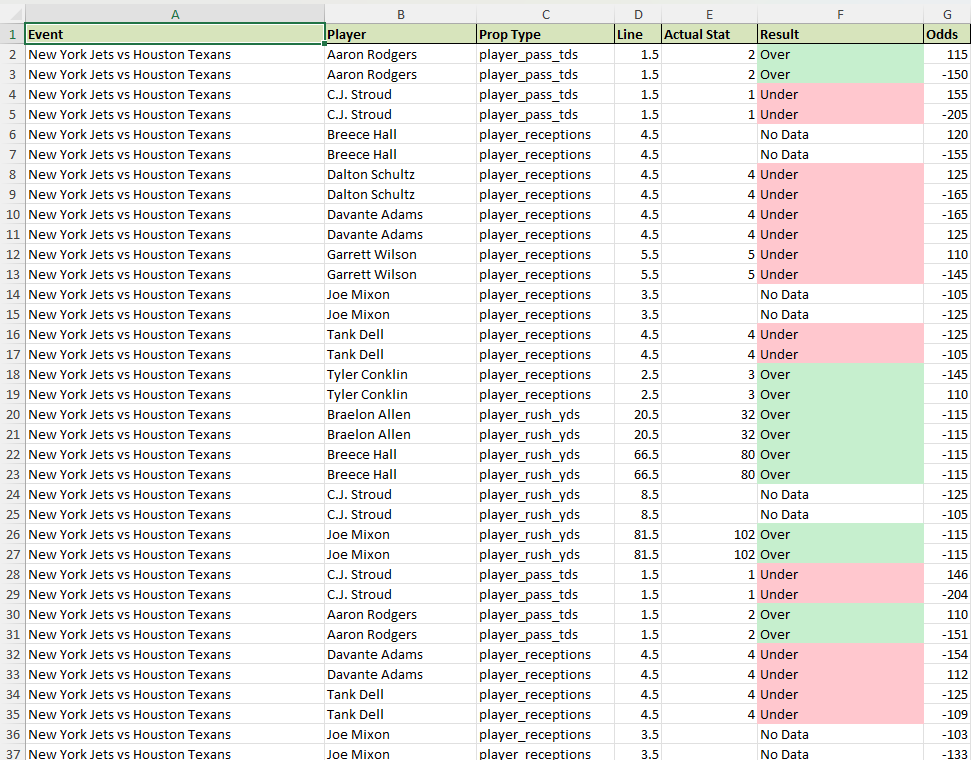
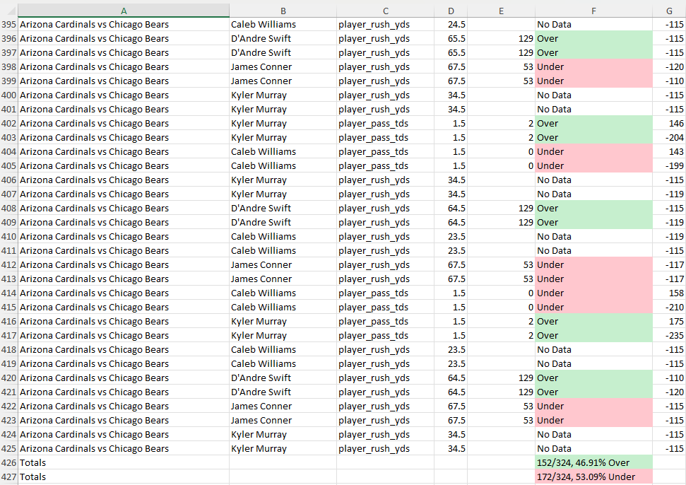

# NFL Stats and Props Analyzer

NFL Stats and Props Analyzer is a desktop application built with Python and `customtkinter` that enables users to download NFL player statistics and player prop betting lines for comparison. This app uses the Odds API and ESPN API to retrieve player props and game stats, making it easy to compare performance data against betting lines.

## Features

- **Download Player Props**: Fetch current week's NFL player prop data.
- **Download Player Stats**: Retrieve player stats for the selected week and year.
- **Compare Stats and Props**: Analyze and compare player stats with the downloaded prop lines.

## Requirements

This app requires the following Python libraries:

- `customtkinter`
- `tkinter`
- `requests`
- `pandas`
- `xlsxwriter`
- `datetime`
- `threading`

You can install these dependencies with the following command:

```bash
pip install customtkinter requests pandas xlsxwriter
```

## API Key Setup

This app uses the [Odds API](https://the-odds-api.com/) to download NFL player prop data. Follow these steps to get your API key:

1. Go to [Odds API](https://the-odds-api.com/) and sign up for an account.
2. Once registered, navigate to your account dashboard and locate your API key.
3. The free plan provides **500 requests per month**. Keep this in mind when using the app to avoid exceeding the limit.
4. Replace the placeholder in the code with your API key:

   ```python
   api_key = "YOUR_API_KEY_HERE"  # Replace with your actual API key
   ```

## Usage

### How to Use:

1. **Download Player Props**: Before the game starts, download the NFL Player Props Excel file for the matchup you want to analyze. Note: If you can match the layout of the Excel sheet and have past NFL player prop lines, you can import those to compare stats for any previous week.

2. **Download Player Stats**: After the games have ended, enter the relevant week number and year, then click "Download NFL Stats Excel." This will pull in the statistics for players from that week.

3. **Compare Stats and Props**: Once both files are downloaded, select "Compare Stats and Props" to view how player performances aligned with the props.

### Example Screenshots

#### Main Application Interface


#### Example of Downloaded Player Props Excel


#### Example of Downloaded Player Stats Excel




#### Example of Comparison Excel Output



## Code Structure

- **`nfl_app.py`**: Main application file that sets up the GUI and handles downloading and comparing data.
- **Functions**:
  - `download_nfl_stats`: Fetches NFL stats based on selected week and year.
  - `download_nfl_props`: Retrieves player prop data for the current week.
  - `compare_stats_and_props`: Compares downloaded stats with props, displaying "Over", "Under", or "No Data" for each player prop.

## Excel Output Structure

The app saves data in Excel format for easy analysis:
- **Player Stats Excel**: Contains weekly player stats, organized by game and team.
- **Player Props Excel**: Includes player prop data with lines and odds.
- **Comparison Excel**: Displays the comparison of player props with actual stats, including conditional formatting for "Over" (green) and "Under" (red).

## Troubleshooting

- **API Limit**: Remember, the free API key provides only 500 requests per month. Be mindful of this limit to avoid interruptions.
- **Data Unavailability**: Some players may not have stats available if they didn’t play or were inactive. The app will mark such entries as "No Data."

## License

This project is licensed under the MIT License.

---
